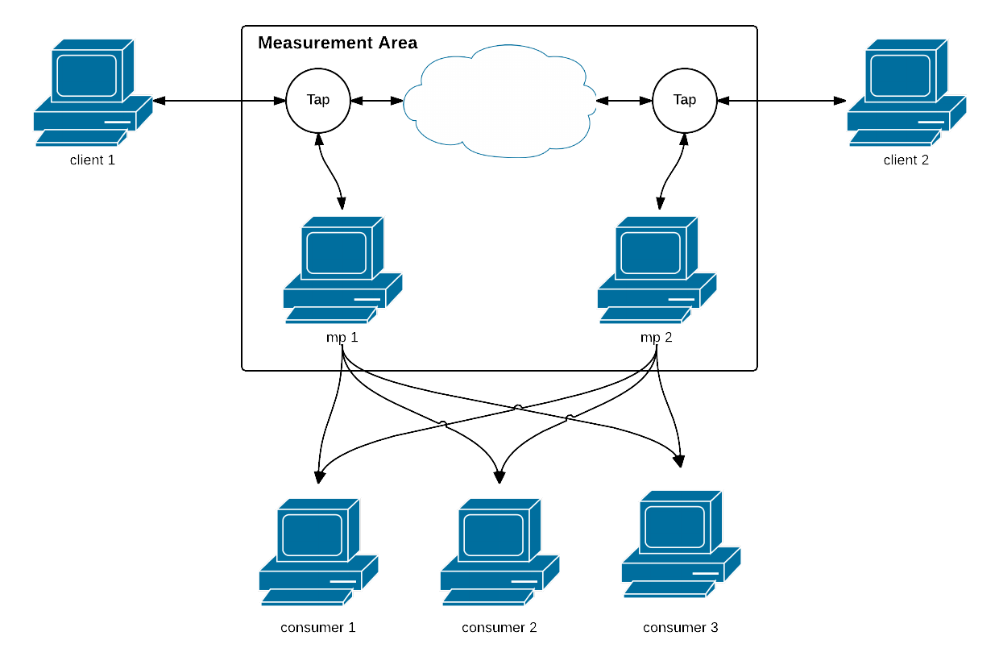

# Overview

## Measurement points

A measurement area (MA) consists of any number of measurement points
(MP) which can be added in parallel or serial. Each MP has a set of
filters (e.g. single out only IP-traffic) and will send out
any number of measurement streams for consumers to analyze. Streams are most
commonly broadcasted as MA ethernet frames but MPs can also send using
UDP or TCP and can save as a local capfile.

As seen in the figure there are two MPs capturing traffic at two
locations. The MPs may be located in the same network or they can be
at geografically different locations (but be vary of timestamp
accuracy!). In this case the MPs both broadcast a single stream.

## Consumers

Consumers takes any number of measurement streams and can perform
analyzations on the stream.

Going back to the figure there are three consumers an each of them
listens on the streams from the MPs. One of the might calculate
current bitrate at both captured locations, while another might
calculate one-way delay (the time it takes for a packet to go from
location 1 to location 2). The third might just be recording the
streams for later usage.

<tt>libcap_utils</tt> comes with a number of consumers (called tools)
for common tasks such as filtering, recording and displaying
streams. It also features an API for interfacing with streams and
processing packets.
